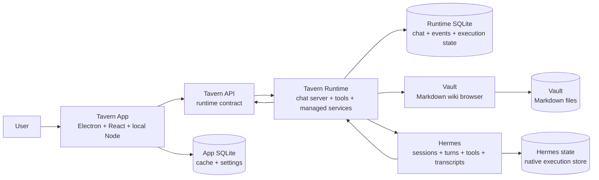

# Architecture Overview

Tavern is an always-on local chat server plus a polished Mac client.

Tavern Runtime owns the canonical chat server and local service connections. Tavern App
is the first-party client for that server. Hermes owns native agent execution.

## Layers

* **Tavern App** presents chats, responses, activity, artifacts, agents, memory
  inspection, Vault, automations, skills, stats, and settings. React
  and the local Node/tRPC layer are implementation pieces of one client
  boundary.
* **Tavern API** is the client-facing contract for chat, agents, memory
  inspection, Vault, automations, skills, stats, and settings. The
  runtime is the authoritative host for chat and execution-facing API state.
* **TypeScript SDK** is a client wrapper around the Tavern API for bots,
  webhooks, automations, managed Hermes, local tools, and other clients.
* **App SQLite** stores client cache, app-local settings, and presentation state.
* **Tavern Runtime** stores canonical chat state, responses, activity,
  artifacts, starts managed Hermes, applies Tavern-owned config, runs
  automations, carries runtime events, exposes Vault reads, and exposes
  Tavern tools to agents.
* **Runtime SQLite** stores chats, messages, responses, activity, artifacts,
  participants, events, reads, channel ingress, execution evidence, and runtime
  metadata.
* **Vault** is the app and Runtime read surface for the user's Markdown wiki.
  The Vault files are the durable knowledge source. Agents maintain them
  through the managed `vault` skill.
* **Hermes** owns agent execution: sessions, turns, model calls, tools, files,
  and native transcripts.

## State And Transport

* `~/.tavern/runtime` is the default backup root for Tavern-owned
  Runtime state. `TAVERN_RUNTIME_ROOT` can point Runtime at another root.
* Runtime SQLite is the durable source for chats, messages, responses, activity,
  artifacts, participants, events, reads, automation delivery, channel ingress,
  accepted message identity, execution evidence, and runtime metadata.
* Vault reads pages, links, backlinks, and search results from the wiki root
  resolved by Runtime.
* App SQLite is a client cache and app-local settings store.
* Hermes stores native execution state.
* Tavern maps Hermes execution into Tavern messages, responses, artifacts,
  activity, and runtime evidence. It does not replace canonical Tavern chat
  history.
* Runtime creates and updates Tavern chat records through the Chat API before
  Hermes dispatch. The Hermes relay is transport only: it references
  existing chat and message ids, and it must not create chats or mutate
  Tavern-owned chat metadata.
* Websocket events are notifications and freshness signals, not durable storage.
* Response activity is durable and statusful. Running and completed tool rows
  use the same records.
* Chat UIs render response activity from `chat.log.list`. App-local active reply
  state is only for pre-activity thinking, streamed reply text, and failures.
* Live response activity events patch the `chat.log.list` cache by stable row id.
  Completion and recovery reads reconcile the same ids from Runtime storage.
* Missed live events are recovered through runtime chat history, response reads,
  activity reads, artifact reads, or focused sync.

## Cross-Cutting Docs

* [API overview](../api/overview.md) - client-facing and runtime-facing surfaces.
* [Data model](data-model.md) - tables, ids, and invariants.
* [Realtime](../api/realtime.md) - durable vs ephemeral events, reconnect recovery.
* [Auth](../api/auth.md) - local owner and runtime trust model.
