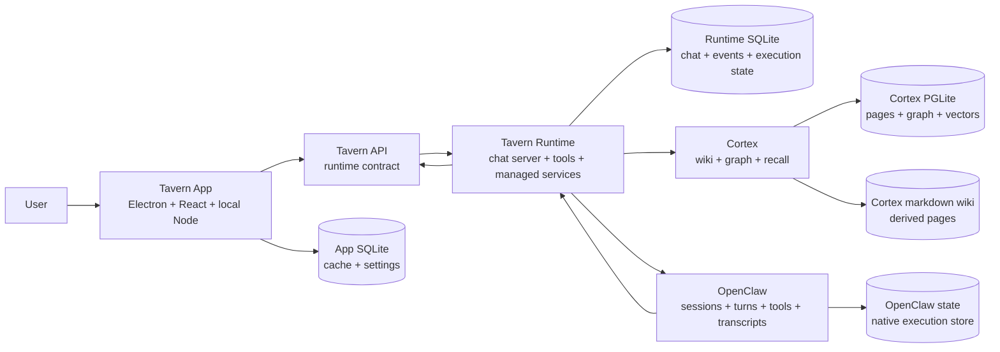

# Architecture Overview

Tavern is an always-on local chat server plus a polished Mac client.

Tavern Runtime owns the canonical chat server and local integration. Tavern App
is the first-party client for that server. OpenClaw owns native agent execution.

## Layers

* **Tavern App** presents chats, responses, activity, artifacts, agents, memory
  inspection, the Cortex wiki, automations, skills, stats, and settings. React
  and the local Node/tRPC layer are implementation pieces of one client
  boundary.
* **Tavern API** is the client-facing contract for chat, agents, memory
  inspection, the Cortex wiki, automations, skills, stats, and settings. The
  runtime is the authoritative host for chat and execution-facing API state.
* **TypeScript SDK** is a client wrapper around the Tavern API for bots,
  webhooks, automations, managed OpenClaw, local tools, and other clients.
* **App SQLite** stores client cache, app-local settings, and presentation state.
* **Tavern Runtime** stores canonical chat state, responses, activity,
  artifacts, starts managed OpenClaw, applies Tavern-owned config, runs
  automations, carries runtime events, owns Cortex, and exposes Tavern tools to
  agents.
* **Runtime SQLite** stores chats, messages, responses, activity, artifacts,
  participants, events, reads, channel ingress, execution evidence, and runtime
  metadata.
* **Cortex** is the Runtime-owned durable knowledge and memory system. Its
  canonical records live in a separate embedded Postgres-compatible PGLite
  database under the Runtime root. Markdown wiki files are the editable page
  surface and project into that database; vector embeddings live in the Cortex
  DB through `pgvector`/PGLite `vector`.
* **OpenClaw** owns agent execution: sessions, turns, model calls, tools, files,
  and native transcripts.

## State And Transport

* `~/.tavern` is the local backup root for Tavern-owned state.
* Runtime SQLite is the durable source for chats, messages, responses, activity,
  artifacts, participants, events, reads, automation delivery, channel ingress,
  accepted message identity, execution evidence, and runtime metadata.
* Cortex stores pages, sources, claims, timelines, links, chunks, vector
  encodings, captures, jobs, settings, schemas, audit events, and chat ingestion cursors
  in `~/.tavern/runtime/cortex/cortex.pglite` by default. The markdown wiki is
  rebuildable from that state plus page source material.
* App SQLite is a client cache and app-local settings store.
* OpenClaw stores native execution state.
* Tavern maps OpenClaw execution into Tavern messages, responses, artifacts,
  activity, and runtime evidence. It does not replace canonical Tavern chat
  history.
* Runtime creates and updates Tavern chat records through the Chat API before
  OpenClaw dispatch. The OpenClaw relay is transport only: it references
  existing chat and message ids, and it must not create chats or mutate
  Tavern-owned chat metadata.
* Websocket events are notifications and freshness signals, not durable storage.
* Response activity is durable and statusful. Running and completed tool rows
  use the same records.
* Chat UIs render response activity from `chat.log.list`. App-local active reply
  state is only for pre-activity thinking, streamed reply text, and failures.
* Live response activity events patch the `chat.log.list` cache by stable row id.
  Completion and recovery reads reconcile the same ids from Runtime storage.
* Missed live events are recovered through runtime chat history, response reads,
  activity reads, artifact reads, or focused sync.

## Cross-Cutting Docs

* [API overview](../api/overview.md) - client-facing and runtime-facing surfaces.
* [Data model](data-model.md) - tables, ids, and invariants.
* [Realtime](../api/realtime.md) - durable vs ephemeral events, reconnect recovery.
* [Auth](../api/auth.md) - local owner and runtime trust model.
