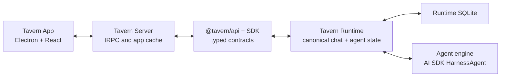

# Architecture Overview

Tavern is a chat app for humans and agents. Runtime is the product backend.
Agent executors are implementation details behind Runtime.

## Layers

| Layer | Owns |
| --- | --- |
| Tavern App | Electron shell, React routes, local presentation, optimistic UI, and app-local cache. |
| Tavern Server | Thin tRPC facade, app cache, connection setup, and UI-friendly projections. |
| Tavern API / SDK | Stable contracts for chats, realtime, agents, models, tools, memory, jobs, and Runtime admin. |
| Tavern Runtime | Canonical Chats, messages, participants, Agent sessions, Agent turns, model catalog, tools, Memory reads, and execution. |
| Agent engine | Runtime-internal execution through AI SDK HarnessAgent adapters. |

## Product Model

- A **Chat** is a durable conversation container. It can be a channel or a DM.
- A **Chat participant** is a human, Agent, system actor, or external actor in a
  Chat.
- An **Agent seat** is an Agent participant in a Chat.
- An **Agent session** is the current execution context for one Agent seat.
- An **Agent turn** is one execution attempt inside an Agent session.

The Chat timeline is canonical product state. Agent execution traces are
evidence, not the product timeline.

## Runtime Boundary

Runtime is the source of truth for values that affect execution:

- model catalog
- Agent default model
- current Agent session
- Agent session effective model
- tool inventory diagnostics
- Plugin grants
- sandbox mode
- turn queue and turn status
- response activity and assistant messages

Tavern App and Server must not reconstruct those values from UI state or a
random chatroom. Settings that change execution call Runtime. Headless clients
can perform the same actions through Runtime API.

## Execution Boundary

Runtime executes every Agent turn through model record `executionKind: harness`.

- Claude Code and Codex use their native AI SDK harness adapters.
- OpenAI and OpenAI-compatible API-key models use the Pi harness adapter.

Executors write Tavern-native messages and activity through Runtime stores.
Provider-specific details remain metadata.

## Recovery

Realtime streams are delivery paths, not storage. If a browser reconnects, it
refetches durable Runtime chat state and subscribes to active turn events.
Runtime must settle failed, cancelled, and interrupted turns as durable Tavern
state.

## References

- [ADR 0007](../adr/0007-chat-participants-own-agent-sessions.md)
- [Agent Engine Runtime](agent-engine-runtime.md)
- [Data Model](data-model.md)
- [Realtime](../api/realtime.md)
