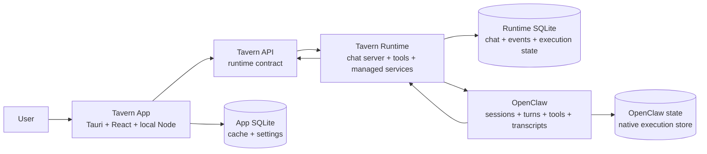

---
read_when:
  - changing the boundary between Tavern App, Tavern Runtime, and OpenClaw
  - changing realtime recovery, projection sync, or managed runtime ownership
---

# Architecture Overview

Tavern is an always-on local chat server plus a polished Mac client.

Tavern Runtime owns the canonical chat server and local integration. Tavern App
is the first-party client for that server. OpenClaw owns native agent execution.

## Layers

* **Tavern App** presents chats, agents, memory, automations, skills, stats, and
  settings. React and the local Node/tRPC layer are implementation pieces of one
  client boundary.
* **Tavern API** is the client-facing contract for chat, agents, memory,
  knowledgebase, automations, skills, stats, and settings. The runtime is the
  authoritative host for chat and execution-facing API state.
* **TypeScript SDK** is a client wrapper around the Tavern API for bots,
  webhooks, automations, managed OpenClaw, local tools, and other clients.
* **App SQLite** stores client cache, app-local settings, and presentation state.
* **Tavern Runtime** stores canonical chat state, starts managed OpenClaw,
  applies Tavern-owned config, runs automations, carries runtime events, and
  exposes Tavern tools to agents.
* **Runtime SQLite** stores chats, messages, participants, events, reads,
  channel ingress, execution evidence, and runtime metadata.
* **OpenClaw** owns agent execution: sessions, turns, model calls, tools, files,
  and native transcripts.

## State And Transport

* `~/.tavern` is the local backup root for Tavern-owned state.
* Runtime SQLite is the durable source for chats, messages, participants,
  events, reads, automation delivery, channel ingress, accepted message
  identity, execution evidence, and runtime metadata.
* App SQLite is a client cache and app-local settings store.
* OpenClaw stores native execution state.
* OpenClaw-owned execution records are synced into runtime/app projections as
  execution evidence. They do not replace canonical Tavern chat history.
* Websocket events are notifications and freshness signals, not durable storage.
* Active chat activity is volatile transport state. It may be rendered by the
  app, but it does not become a second durable chat history.
* Missed live state is recovered through runtime chat history, event cursors,
  sync, or explicit status reads.

## Cross-Cutting Docs

* [API overview](../api/overview.md) - client-facing and runtime-facing surfaces.
* [Data model](data-model.md) - tables, ids, and invariants.
* [Realtime](../api/realtime.md) - durable vs ephemeral events, cursor recovery.
* [Auth](../api/auth.md) - local owner and runtime trust model.
