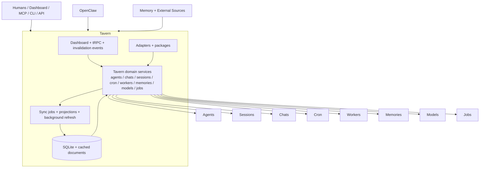

# System

Tavern sits between people, OpenClaw, and supporting data systems. It owns the product model and
maps external systems into Tavern-owned domains.

## Reading The Diagram

- Tavern owns the domain model in the middle.
- OpenClaw and external systems plug in through adapters and packages, not by owning Tavern
  domains.
- The dashboard and API read Tavern-owned stored and projected state rather than depending on live
  runtime availability.
