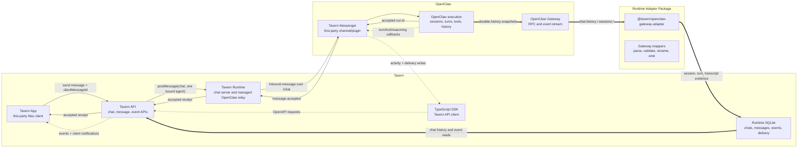

# Tavern Messenger Runtime Channel

Tavern Messenger is Tavern's first-party chat channel for OpenClaw. The channel is not ACP, a
generic IDE bridge, or a fallback over OpenClaw's operator session APIs.

## Position

```txt
Tavern App
  -> Tavern API
  -> Tavern Runtime chat server
  -> Tavern Messenger channel/plugin
  -> OpenClaw execution
```

Tavern App speaks Tavern API records such as `chat`, `message`, `event`, `session`, `turn`, and
`tool`. Tavern Runtime owns the durable chat server and keeps OpenClaw Gateway payloads behind the
OpenClaw adapter.

## Architecture



The fast lane is the accepted receipt plus SDK-backed activity writes. The durable lane is
Runtime-owned chat state linked to OpenClaw history as execution evidence. The UI renders progress
from Runtime activity while durable message history stays canonical.

## Model

- One Tavern chat has exactly one bound OpenClaw agent.
- One Tavern chat is one long-lived, single-threaded conversation.
- Sends use text as the agent-facing prompt and may include Tavern-owned message metadata for
  presentation.
- Tavern App does not choose an "active agent" inside a chat.
- Tavern Runtime must install the Tavern Messenger plugin into managed OpenClaw before launch and
  report that install as the `tavernPlugin` capability. Tavern chat send does not fall back to
  `sessions.send`, `chat.send`, ACP, platform-specific targets, or Tavern-specific Gateway RPCs.

Tavern Runtime accepts Tavern chat messages through Tavern API and relays private channel frames to
the Tavern Messenger plugin.

## Channel Responsibilities

Tavern Messenger channel/plugin preserves first-party Tavern facts instead of forcing Tavern to
reconstruct them from transport-specific labels.

- Stable Tavern chat id.
- OpenClaw session key for the chat's single bound agent. OpenClaw Tavern session keys must be
  chat-specific, using `agent:<agent-id>:tavern:channel:<tavern-chat-id>`, with OpenClaw
  `chatType: "channel"` and `peer.kind: "channel"`. They must not collapse to the agent's `main`
  session through generic direct-message scoping.
- OpenClaw session id when available. This is the current transcript identity for the session key,
  not the chat/session routing key. Tavern stores it as the session id while still using
  `sessionKey` for lookup and sends.
- Client message id or idempotency key supplied by Tavern.
- Optional message metadata supplied by Tavern, including `metadata.tavern.toolMentions`.
- OpenClaw run, turn, message, and tool call ids when OpenClaw creates them.
- Participant ids, observed labels, and source identity facts.
- Delivery metadata such as accepted, delivered, failed, active reply, approval, and tool state.
- Timestamps supplied by the source event or runtime record.

If a required id, timestamp, actor, or session key is absent, the plugin or adapter reports a
degraded capability or fails the mapping. It does not invent product identity.

The channel/plugin must not publish a Tavern chat catalog. Tavern Runtime owns Tavern chat
existence, bindings, durable messages, and labels. Tavern App owns presentation. OpenClaw Tavern
sessions are execution facts that attach to an existing Tavern chat; they are not a source for
creating or renaming Tavern chats.

## Adapter Responsibilities

The OpenClaw adapter maps Gateway payloads into Tavern API records and runtime evidence records.

- Do not require Tavern Messenger plugin methods for Tavern chat send or chat registry operations.
- Validate required Tavern Messenger fields.
- Normalize OpenClaw Gateway event names into runtime evidence invalidation records.
- Do not map OpenClaw Tavern sessions into `AgentRuntimeChat` rows. Tavern chat rows come only from
  Tavern-owned create/update flows.
- Map external runtime-owned channel chats into runtime chat evidence rows with typed platform
  metadata.
- Map durable runtime history into session message records.
- Keep live reply and tool activity on the Tavern API activity path, not adapter-local chat events.
- Keep Gateway method names, plugin versions, and channel quirks out of app/domain code.

The adapter is mostly `parse -> validate -> rename -> emit`. If it must derive product meaning from
labels or opaque ids, the Tavern Messenger channel contract is missing a field.

## Runtime Relay

Tavern Runtime exposes a private local WebSocket at `/chat`. Tavern Messenger plugin connects to
that relay from inside managed OpenClaw. Tavern API writes chat sends into Runtime, and Runtime
forwards them as `inbound-message` frames.

The plugin writes turn activity through `@tavern/sdk` and the Tavern Chat API. Activity can include
tool starts, tool results, command output, plan updates, assistant draft text, and provider-exposed
reasoning summaries. Tavern renders it as progress only; it is not a durable transcript record and
does not expose private reasoning content.

Runtime WebSocket delivery is a notification path, not the source of truth. Tavern Runtime stores
durable messages, cursor-backed chat events, and current activity before broadcasting. The private
plugin relay keeps only a small outbox keyed by the durable Tavern message id. A reconnecting client
must be able to backfill accepted messages and active turn state from Runtime over HTTP or websocket
replay using a cursor. If a websocket notification is missed, hard reload still reconstructs the
accepted user message, active reply state, and active progress steps from Runtime state.

## Message Metadata

Tavern Messenger preserves Tavern-owned message metadata on the durable user message. OpenClaw may
store the metadata, but it does not interpret `metadata.tavern`.

Inline tool mentions use this shape:

```json
{
  "metadata": {
    "tavern": {
      "toolMentions": [
        {
          "kind": "skill",
          "id": "chrome",
          "label": "Chrome",
          "text": "Chrome",
          "start": 4,
          "end": 10
        }
      ]
    }
  }
}
```

The text sent to the agent remains the normal message content. Tool mention metadata is a durable
presentation hint for Tavern chat history, not a tool call, command, policy grant, or extra model
instruction.

## Chat Send Flow

Tavern does not wait for durable history sync before showing progress.

1. Tavern App creates a client message id and renders an app-local optimistic user row.
2. Tavern Runtime validates the selected chat has exactly one bound agent and a synced session key.
3. Tavern Runtime creates or reuses the durable Tavern API message and cursor-backed
   `message.created` event.
4. Tavern Runtime writes a private plugin outbox entry keyed by the durable message id, then relays
   an `inbound-message` with the chat id, bound OpenClaw agent id, session key, message text,
   message id, nonce, per-chat sequence, and optional message metadata.
5. Tavern Messenger accepts the send and returns a run id through Runtime.
6. Tavern Runtime exposes the accepted message through chat history so reload does not wait for
   final transcript sync.
7. The plugin writes active reply, message delta, tool, reasoning-summary, and completion state to
   Tavern API activity. Leaving and returning to a chat reads the current activity state from
   Runtime.
8. Tavern Messenger persists the accepted Tavern message id, nonce, run id, session key, and
   sequence into OpenClaw transcript history.
9. OpenClaw transcript sync links execution evidence by stable Tavern ids. The accepted user row and
   final assistant delivery are already durable Tavern records, so final sync is a pure evidence
   upsert rather than content/timestamp deduplication.

Optimistic rows are app-local presentation state. Accepted messages and active turn state are
recoverable Runtime state, but active reply progress is not a second durable transcript.

## ACP

ACP is not part of Tavern Messenger. ACP may remain useful for IDE or client harness integration,
but Tavern Messenger is the primary channel for Tavern chat because it preserves richer Tavern
concepts such as chat identity, participants, approvals, active reply state, tool execution, and
delivery metadata.
