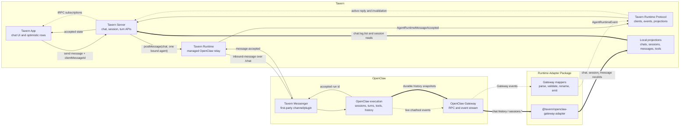

# Tavern Messenger Runtime Channel

Tavern Messenger is Tavern's first-party chat channel for OpenClaw. The channel is not ACP, a
generic IDE bridge, or a fallback over OpenClaw's operator session APIs.

## Position

```txt
Tavern App
  -> Tavern Server
  -> OpenClaw Gateway adapter
  -> OpenClaw Gateway
  -> Tavern Messenger channel/plugin
  -> OpenClaw execution
```

Tavern App and Tavern Server code speak Tavern Runtime Protocol records such as `chat`, `session`,
`turn`, `message`, and `tool`. OpenClaw Gateway payloads stay behind Tavern Runtime and the
OpenClaw adapter.

## Architecture



The fast lane is the accepted run id plus live reply/tool events relayed through Tavern Runtime. The
durable lane is runtime history sync into local projections. The UI can render progress from the
fast lane while durable history catches up.

## V1 Model

Tavern Messenger v1 intentionally keeps the chat model small.

- One Tavern chat has exactly one bound OpenClaw agent.
- One Tavern chat is one long-lived, single-threaded conversation.
- Sends use text as the agent-facing prompt and may include Tavern-owned message metadata for
  presentation.
- Tavern App and Tavern Server do not choose an "active agent" inside a chat.
- Multi-agent chat, fan-out, attachments, and rich message composition are future work.
- Tavern Runtime must install the Tavern Messenger plugin into managed OpenClaw before launch and
  report that install as the `tavernPlugin` capability. Tavern chat send does not fall back to
  `sessions.send`, `chat.send`, ACP, platform-specific targets, or Tavern-specific Gateway RPCs.

Tavern Server sends Tavern chat messages to Tavern Runtime, which relays private channel frames to
the Tavern Messenger plugin.

## Channel Responsibilities

Tavern Messenger channel/plugin should preserve first-party Tavern facts instead of forcing
Tavern to reconstruct them from transport-specific labels.

- Stable Tavern chat id.
- OpenClaw session key for the chat's single bound agent. OpenClaw Tavern session keys must be
  chat-specific, using `agent:<agent-id>:tavern:channel:<tavern-chat-uuid>`, with OpenClaw
  `chatType: "channel"` and `peer.kind: "channel"`. They must not collapse to the agent's `main`
  session through generic direct-message scoping.
- OpenClaw session id when available. This is the current transcript identity for the session key,
  not the chat/session routing key. Tavern stores it as the session id while still using
  `sessionKey` for lookup and sends.
- Client message id or idempotency key supplied by Tavern.
- Optional message metadata supplied by Tavern, including `metadata.tavern.toolMentions`.
- OpenClaw run, turn, message, and tool call ids when OpenClaw creates them.
- Participant ids, observed labels, and source identity facts.
- Delivery metadata such as accepted, delivered, failed, active reply, approval, and tool state.
- Timestamps supplied by the source event or runtime record.

If a required id, timestamp, actor, or session key is absent, the plugin or adapter should report a
degraded capability or fail the mapping. It should not invent product identity.

The channel/plugin must not publish an Tavern chat catalog. Tavern App and Tavern Server own Tavern
chat existence, labels, bindings, and presentation. OpenClaw Tavern sessions are runtime facts that
attach to an existing Tavern chat; they are not a source for creating or renaming Tavern chats.

## Adapter Responsibilities

The OpenClaw adapter maps Gateway payloads into Tavern Runtime Protocol records.

- Do not require Tavern Messenger plugin methods for Tavern chat send or chat registry operations.
- Validate required Tavern Messenger fields.
- Normalize OpenClaw Gateway event names into `AgentRuntimeEvent` records.
- Do not map OpenClaw Tavern sessions into `AgentRuntimeChat` rows. Tavern chat rows come only from
  Tavern-owned create/update flows.
- Map external runtime-owned channel chats into `AgentRuntimeChat` rows with typed platform
  metadata.
- Map durable runtime history into session message records.
- Map live reply and tool events into volatile protocol events.
- Keep Gateway method names, plugin versions, and channel quirks out of app/domain code.

The adapter should be mostly `parse -> validate -> rename -> emit`. If it must derive product
meaning from labels or opaque ids, the Tavern Messenger channel contract is missing a field.

## Runtime Relay

Tavern Runtime exposes a private local WebSocket at `/chat`. Tavern
Messenger plugin connects to that relay from inside managed OpenClaw. Tavern Server posts chat sends
to Runtime, and Runtime forwards them as `inbound-message` frames.

The plugin should broadcast Tavern-specific turn events such as `plugin.tavern.turn.started`,
`plugin.tavern.turn.progress`, `plugin.tavern.turn.completed`, and `plugin.tavern.turn.failed`.
Runtime maps those events to Tavern Runtime Protocol turn events.

`plugin.tavern.turn.progress` is volatile turn state for the active reply row. It may include tool starts,
tool results, command output, plan updates, and coarse reasoning activity. Tavern should render it
as progress only; it is not a durable transcript record and should not expose private reasoning
content.

## Message Metadata

Tavern Messenger preserves Tavern-owned message metadata on the durable user message. OpenClaw may
store the metadata, but it does not interpret `metadata.tavern`.

Inline tool mentions use this shape:

```json
{
  "metadata": {
    "tavern": {
      "toolMentions": [
        {
          "kind": "skill",
          "id": "chrome",
          "label": "Chrome",
          "text": "Chrome",
          "start": 4,
          "end": 10
        }
      ]
    }
  }
}
```

The text sent to the agent remains the normal message content. Tool mention metadata is a durable
presentation hint for Tavern chat history, not a tool call, command, policy grant, or extra model
instruction.

## Chat Send Flow

Tavern should not wait for durable history sync before showing progress.

1. Tavern App creates a client message id and renders an app-local optimistic user row.
2. Tavern Server validates the selected chat has exactly one bound agent and a synced session key.
3. Tavern Runtime relays an `inbound-message` with the chat id, bound OpenClaw agent id, session
   key, message text, client message id, and optional message metadata.
4. Tavern Messenger accepts the send and returns a run id through Runtime.
5. Tavern maps that acceptance into app-local accepted state.
6. Live runtime events update volatile active reply, message delta, tool, and completion state.
7. Durable history sync later replaces optimistic and volatile presentation with persisted records.

Optimistic rows and active reply indicators are app-local presentation state. They are not durable
transcript sync.

## ACP

ACP is not part of Tavern Messenger. ACP may remain useful for IDE or client harness integration,
but Tavern Messenger is the primary channel for Tavern chat because it preserves richer Tavern
concepts such as chat identity, participants, approvals, active reply state, tool execution, and
delivery metadata.
