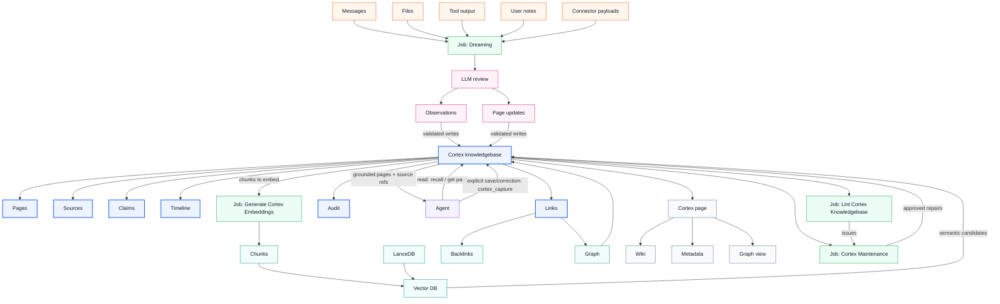

# Cortex

Cortex is Tavern's durable brain: a Runtime-owned knowledgebase of pages,
observations, links, timelines, chunks, and recall audit.

Agents read from Cortex when durable knowledge matters. Dreaming stores new
memories from recent chats and other sources.

## Architecture

Cortex is the center. Agents, jobs, indexes, and app surfaces read from or write
to the same knowledgebase.

Legend: blue is the knowledgebase, orange is source material, purple is the
agent/tool path, green is jobs, pink is model review, teal is derived indexes,
and gray is an app surface.

## Agent Read Path

The agent receives short Cortex instructions through managed agent instructions
or `AGENTS.md`:

* Use `cortex_recall` or `cortex_get_page` when prior durable knowledge may
  affect the answer.
* Cite Cortex page/source refs when recalled knowledge changes the answer.
* Use `cortex_capture` only for explicit user-requested saves or corrections.

Cortex agent tools are `cortex_recall`, `cortex_capture`, `cortex_get_page`,
`cortex_list_backlinks`, and `cortex_search`. Cortex status and job control
belong to Runtime APIs and app/admin surfaces, not the agent-facing tool set.

## Recall

Recall retrieves durable knowledge when a task needs more than the current
conversation.

Agent guidance:

* Recall before answering questions about known projects, people, preferences,
  decisions, prior work, or durable facts.
* Recall before external lookup when Cortex may already contain the answer.
* Do not recall for purely local reasoning, one-off transformations, or
  requests where the user provides all required context.
* Cite page/source refs when recall materially affects the answer.

Recall can combine:

* title, slug, alias, and tag matching
* lexical search over chunks
* vector search over current encodings
* graph expansion through links and backlinks
* recency and source-quality signals
* page type and visibility filters

Recall returns bounded page hits with snippets, source refs, scores, and an
audit id. Agents receive grounded context, not raw database rows.

Recall has budget modes:

| Mode | Expansion | Default limit | Use |
| --- | --- | --- | --- |
| `conservative` | off | 10 chunks | Cost-sensitive or high-volume recall. |
| `balanced` | off | 25 chunks | Default Tavern mode. |
| `tokenmax` | on | 50 chunks | Deep synthesis with explicit user or agent policy approval. |

Query expansion is an LLM call. It is disabled unless the selected mode and
configured model policy allow it. Runtime records the mode, expanded queries,
returned ids, and costs in recall audit.

The current implementation supports configured and per-call recall modes, uses
the mode to choose the default result limit, and audits the effective mode.
Query expansion, reranking, graph-aware ranking, and cost tracking are not yet
implemented.

## Dreaming

The `dreaming` job reviews bounded source material and saves durable memory into
Cortex with provenance.

Capture input contains:

* `sourceRefs`: chat/message ids, file paths, URLs, transcript ranges, or tool
  output ids
* `scope`: bounded text/range under review
* `captureKey`: idempotency key
* `intent`: `fact`, `decision`, `observation`, `correction`, `event`,
  `preference`, `task`, or `note`
* `candidatePage`: optional page id, slug, or title
* `actor`: user, agent, job, or connector identity

The job pipeline:

1. Registers immutable source refs.
2. Recalls nearby pages and backlinks for context.
3. Reviews the bounded source range with the active agent model.
4. Extracts observations, decisions, facts, entities, dates, and relationships.
5. Chooses create, update, merge, split, archive, or no-op.
6. Produces a structured write proposal.
7. Runtime validates the proposal against Cortex schema and source refs.
8. Writes page changes, claims, links, citations, chunks, and audit.
9. Marks affected chunks stale for embedding.

Review output is structured:

| Field | Meaning |
| --- | --- |
| `pageWrites[]` | Page creates or updates with slug, title, type, tags, aliases, compiled truth, open threads, and body. |
| `observations[]` | Source-backed claims with subject, predicate, value, confidence, source refs, and supersession links when relevant. |
| `relationships[]` | Typed links between pages or unresolved slugs. |
| `timelineEntries[]` | Concise source-backed events that explain what changed. |
| `citations[]` | Locators into the reviewed source range. |
| `noops[]` | Reviewed material intentionally not captured, with reason. |
| `warnings[]` | Ambiguity, missing source, conflict, or permission concerns. |

Dreaming is idempotent for the same source range and capture key.
Replays return or update the existing capture record instead of duplicating page
evidence.

`cortex_capture` remains available for explicit user-requested saves. Automatic
capture comes from Dreaming.

## Product Model

Cortex has sources, pages, and derived indexes. Sources are immutable evidence:
chats, messages, files, transcripts, URLs, user notes, tool outputs, and
connector payloads. Pages are flat markdown records with stable ids, slugs,
aliases, tags, compiled truth, body content, timelines, links, and metadata.
Derived indexes include chunks, lexical indexes, vectors, graph records,
mirrors, and health summaries.

Each durable fact belongs to a primary page. Related pages link to each other
instead of duplicating the same fact.

## Page Contract

Markdown is the human and agent-facing page format. Runtime SQLite is canonical
for ids, provenance, embeddings, audit, and job state.

Every page has frontmatter with stable id, slug, type, aliases, tags, source
refs, status, timestamps, and content hashes. Body sections are `Compiled
Truth`, `Open Threads`, `See Also`, and append-only `Timeline`.

* **Compiled truth.** Current best understanding; rewritable only with
  provenance.
* **Timeline.** Append-only evidence: change, time, actor, and source refs.
* **Claims.** Structured facts with subject, predicate, value, source refs,
  confidence, observed time, status, and supersession links.
* **Links.** Wiki links use `[[target-slug]]`, `[[target-slug|label]]`, or
  `[[target-slug#heading]]`; unresolved links are valid graph records.

Typed relationships use link kinds such as `mentions`, `supports`,
`contradicts`, `depends_on`, or `same_as`.

## Indexing

Chunks are deterministic searchable text units derived from pages or sources.
Encodings are model-specific vector embeddings derived from chunk text.

Runtime SQLite stores canonical Cortex records. The vector database is a
derived semantic search index. The current backend is LanceDB behind the generic Cortex
vector database API. Capture, recall, and jobs must depend on that API, not on
LanceDB-specific names or behavior.

An encoding is current only when provider, model, dimensions, and input text
hash match the active chunk. Stale encodings are excluded from vector recall
until repair.

## Import And Backfill

Runtime can ingest existing markdown into Cortex when a user points Tavern at a
source folder or file set.

Import registers each file as a source, creates or updates pages from
frontmatter/body, preserves path and content hash, extracts links and dated
timeline entries, chunks changed pages, marks encodings stale, and exports
normalized markdown mirrors.

Backfill jobs are incremental by changed file, changed page, or `since`
timestamp. Re-running them does not duplicate pages, links, timeline entries,
chunks, or audit.

## Jobs

Cortex jobs keep the brain current, searchable, and trustworthy.

| Job | Purpose |
| --- | --- |
| Dreaming | Review recent chats and selected source ranges, extract memory proposals, update pages, append timeline evidence, extract claims and links, attach citations, and write audit. |
| Ingest Knowledge | Register configured source files or folders and import markdown into Cortex. |
| Generate Cortex Embeddings | Embed missing or stale chunks with the configured embedding model and update the vector database. |
| Lint Cortex Knowledgebase | Detect broken links, duplicate pages, stale pages, conflicting claims, orphan pages, missing citations, source gaps, and stale encodings. |
| Cortex Maintenance | Apply safe or approved fixes from lint: merge pages, refresh compiled truth, resolve links, repair encodings, normalize timelines, rebuild derived state, and update audit. |

Jobs are Tavern Runtime jobs. OpenClaw may trigger visible summaries or agent
work that uses Cortex, but Runtime is the store and execution owner. Runtime
runs jobs through its Bunqueue-backed runner, stores run history in
`runtime_job_runs`, and exposes `/jobs`, `/jobs/{slug}`, and
`/jobs/{slug}/run`. The app Jobs surface reads those routes so users can
inspect cadence, recent runs, failures, and logs without owning Cortex
maintenance.

Jobs are idempotent and checkpointed. Retrying a failed job must not duplicate
timeline entries, claims, links, chunks, encodings, or audit records.

Default cadence:

| Cadence | Work |
| --- | --- |
| On write | Chunk changed pages, mark stale encodings, export markdown mirrors. |
| After Cortex writes | Debounce and embed stale or missing chunks when embedding settings are ready. |
| Every 15 minutes | Generate embeddings for stale or missing chunks when embedding settings are ready. |
| Daily | Lint links, claims, stale pages, citations, and failed captures. |
| Nightly | Run Dreaming over recent chats and selected source ranges. |
| Weekly | Run Cortex Maintenance for safe repairs and full stale-encoding sweep. |

LLM-bearing jobs require explicit policy. `auto_apply` jobs cannot call a model.
`prompt_required` jobs can call a model only after user approval for that run.
`manual_only` jobs produce instructions and never run unattended.

## Configuration

Cortex settings initially expose:

* OpenAI API key
* embedding model, defaulting to `text-embedding-3-small`
* recall budget mode, defaulting to `balanced`

The vector database backend is not user-selectable in the first product
version. Runtime reports vector health and degraded recall when embeddings or
the vector index are unavailable.

Model-backed review uses the active agent model unless a future Cortex review
model setting is added. Runtime stores model id, cost summary, prompt hash, and
output hash in audit for every review that changes Cortex.

## App Surfaces

Cortex browses pages, page metadata, and graph view. Memory inspects captures,
compiled-truth changes, recall audit, stale embeddings, and maintenance.
Settings configures API key and embedding model. Jobs inspects Cortex runs and
failures. No app surface defines a second durable memory or knowledgebase store.

## Current Status

| Area | Status | Current behavior |
| --- | --- | --- |
| Runtime store | Implemented | Runtime owns Cortex SQLite tables, schema setup, page reads, captures, recall, status, jobs, and markdown mirrors. |
| Agent tools | Implemented | Managed OpenClaw exposes `cortex_search`, `cortex_get_page`, `cortex_capture`, `cortex_recall`, and `cortex_list_backlinks`. Runtime keeps Cortex status and job control as app/admin APIs. |
| Explicit capture | Partial | `cortex_capture` writes submitted content directly; it does not run model-backed review. |
| Links | Partial | Runtime parses explicit `[[wiki links]]` and backlinks. It does not infer typed relationships. |
| Claims | Partial | Runtime creates simple sentence claims. It does not extract schema-guided observations or resolve contradictions. |
| Indexing | Partial | Runtime chunks pages and creates OpenAI embeddings in LanceDB through `cortex-generate-embeddings` for chunks missing or stale under the active embedding model. Cortex writes request debounced embedding generation, and Runtime also runs generate-embeddings on startup and every 15 minutes when embedding settings are ready. |
| Recall | Partial | Recall combines lexical search with current vector hits and audits configured or per-call budget mode. Query expansion, reranking, graph-aware ranking, and cost tracking are not implemented. |
| Jobs | Partial | Runtime `/jobs` exposes `cortex-generate-embeddings`, `cortex-ingest`, `cortex-lint`, and `cortex-maintenance` for listing, detail, manual runs, disabled reasons, and run history. `dreaming` is not implemented. |
| App | Partial | The Cortex page browses flat pages, page content, metadata, and graph view. Settings configure OpenAI API key and embedding model. |
| Model auth | Partial | Runtime shares Codex auth-profile resolution with managed OpenClaw config. Cortex review jobs do not yet call the model. |
| Agent guidance | Implemented | Managed workspace instructions tell the agent when to recall, get pages, search, inspect backlinks, and capture explicit durable saves or corrections. |
| Dreaming | Not implemented | Runtime does not yet review recent chats with an LLM to update Cortex. |

## Out Of Scope

* Automatic prompt-context injection from Cortex.
* A separate memory database.
* User-facing folder hierarchy for Cortex pages.
* Book, email, calendar, voice, or social ingestion as core Cortex behavior.
* Cortex onboarding or recommendation jobs.
* Direct dependency on GBrain at runtime.
