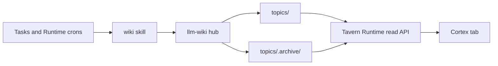

# Cortex

Cortex is Tavern's llm-wiki browser.

The source of truth is the user's llm-wiki hub: plain Markdown topic wikis with
raw sources, compiled articles, inventory records, dataset manifests, outputs,
indexes, config, logs, and archives. Tavern reads those files and presents them
in the Cortex tab.

## Architecture



## Hub Layout

Tavern follows llm-wiki's layout:

```text
~/wiki/
├── wikis.json
├── _index.md
├── log.md
└── topics/
    ├── <topic>/
    │   ├── inbox/
    │   ├── inventory/
    │   ├── datasets/
    │   ├── raw/
    │   ├── wiki/
    │   ├── output/
    │   ├── _index.md
    │   ├── config.md
    │   └── log.md
    └── .archive/
        └── <topic>/
```

Hub path resolution:

1. `TAVERN_WIKI_HUB_PATH` or `TAVERN_CORTEX_WIKI_PATH`
2. `~/.config/llm-wiki/config.json`
3. Runtime-managed `wiki/` under `TAVERN_RUNTIME_ROOT`

Managed Hermes startup prepares the wiki skill package before launch:

* copy the bundled `wiki` workflow skill directory into `HERMES_HOME/skills/wiki`
* create the managed hub skeleton when it does not exist
* pass `TAVERN_WIKI_HUB_PATH` to the Hermes process

## Runtime Contract

Runtime owns only:

* hub resolution
* read/write access checks
* topic listing
* Markdown file listing
* page reads
* light frontmatter parsing
* `[[wikilink]]` extraction
* backlink derivation
* simple title, path, and body search

Runtime does not own:

* PGLite or vector storage
* embeddings
* claims
* schema registries
* source import processors
* chat ingestion
* Dream consolidation
* Cortex repair jobs
* hidden wiki maintenance

## Workflows

Research, ingestion, compilation, audit, librarian, lessons, generated outputs,
inventory maintenance, dataset maintenance, and archive lifecycle run through
llm-wiki. Tavern launches scheduled or repeated wiki work through Tasks and
Runtime crons.

Tavern ships managed default crons for the regular llm-wiki maintenance
cadence: daily incremental compile, weekly `lint --fix`, and a monthly
librarian scan. Runtime reconciles them into Hermes once the hub has an active
topic; see [Automations](../docs/features/automations.md#managed-automations).

## App Surface

The Cortex tab shows:

* topic selector
* Markdown page list
* page body
* file metadata
* wikilinks and backlinks
* active and archived topic coverage

Settings and Memory show hub readiness and counts. They do not expose embedding
or schema controls.
