# Cortex

Cortex is Tavern's durable brain: a Runtime-owned knowledgebase of pages,
observations, links, timelines, chunks, and recall audit.

Agents read from Cortex when durable knowledge matters. Cortex Chat Ingestion captures
new durable memory from chat backlog. Cortex Dream consolidates existing Cortex
pages, audit evidence, sources, graph health, and lint findings later.

## Architecture

Cortex is the center. Agents, jobs, indexes, and app surfaces read from or write
to the same knowledgebase.

```mermaid
flowchart TB
  KB["Cortex knowledgebase"]
  Pages["Pages"]
  Sources["Sources"]
  Claims["Claims"]
  Timeline["Timeline"]
  Links["Links"]
  Audit["Audit"]

  Agent["Agent"] -->|"read: recall / get page"| KB
  KB -->|"grounded pages + source refs"| Agent
  Agent -->|"explicit save/correction: cortex_capture / cortex_edit"| KB

  Ingest["Source ingest"] -->|"normalized bounded text"| KB
  Messages["Chat messages"] --> ChatIngestion["Job: Cortex Chat Ingestion"]
  ChatIngestion --> ChatIngestionReview["LLM chat ingestion review"]
  ChatIngestionReview -->|"validated writes"| KB
  KB --> Dreaming["Job: Cortex Dream"]
  Audit --> Dreaming
  Lint --> Dreaming
  Dreaming --> Review["LLM consolidation review"]
  Review --> Observations["Observations"]
  Review --> PageUpdates["Page updates"]
  Review --> DreamReports["Dream reports"]
  Observations -->|"validated writes"| KB
  PageUpdates -->|"validated writes"| KB
  DreamReports -->|"before/after health + notable items"| KB

  KB --> Pages
  KB --> Sources
  KB --> Claims
  KB --> Timeline
  KB --> Links
  KB --> Audit

  KB -->|"chunks to embed"| EmbeddingsJob["Job: Generate Cortex Embeddings"]
  EmbeddingsJob --> Chunks["Chunks"]
  Chunks --> Vector["PGLite vector index"]
  Vector -->|"semantic candidates"| KB

  Links --> Backlinks["Backlinks"]
  Links --> Graph["Graph"]
  Graph --> KB

  Wiki["Canonical markdown wiki"] -->|"cortex-sync projects"| KB
  KB -->|"writes markdown drafts"| Wiki
  KB --> App["Cortex page"]
  App --> Metadata["Metadata"]
  App --> GraphView["Graph view"]
  Settings["Settings: Memories"] -->|"health cards / schema / embeddings"| KB
  Jobs["Jobs page"] -->|"Runtime job history"| KB
  KB --> Lint["Job: Lint Cortex Knowledgebase"]
  KB --> Repair["Job: Repair Cortex Derived State"]
  Lint -->|"issues / recommendations"| Settings
  Repair -->|"deterministic derived-state repair"| KB

  class KB,Pages,Sources,Claims,Timeline,Links,Audit knowledge
  class Ingest,Messages,Wiki source
  class Agent agent
  class ChatIngestion,Dreaming,EmbeddingsJob,Lint,Repair job
  class ChatIngestionReview,Review,Observations,PageUpdates model
  class Chunks,Vector,Backlinks,Graph index
  class App,Metadata,GraphView,Settings,Jobs app
  classDef knowledge fill:#eef4ff,stroke:#2563eb,color:#111827,stroke-width:2px
  classDef source fill:#fff7ed,stroke:#ea580c,color:#111827
  classDef agent fill:#f5f3ff,stroke:#7c3aed,color:#111827
  classDef job fill:#ecfdf5,stroke:#16a34a,color:#111827
  classDef model fill:#fdf2f8,stroke:#db2777,color:#111827
  classDef index fill:#f0fdfa,stroke:#0d9488,color:#111827
  classDef app fill:#f8fafc,stroke:#64748b,color:#111827
```

Legend: blue is the knowledgebase, orange is source material, purple is the
agent/tool path, green is jobs, pink is model review, teal is derived indexes,
and gray is an app surface.

## Agent Read Path

The agent receives short Cortex instructions through managed agent instructions
or `AGENTS.md`:

* Use Cortex when the user's message depends on context that is not already
  present in the current conversation.
* Use the lightest Cortex tool that fits: `cortex_get_page` for a known page,
  `cortex_search` for names or existence checks, `cortex_recall` for broader
  context, and `cortex_list_backlinks` for relationships.
* Ask a clarifying question or use the appropriate live source when Cortex does
  not resolve the ambiguity.
* Current user messages override Cortex. Live runtime state and current public
  facts should be checked from their source of truth when freshness matters.
* Use `cortex_capture` only for explicit user-requested saves or corrections.

Cortex agent tools are `cortex_recall`, `cortex_capture`, `cortex_ingest`,
`cortex_import`, `cortex_get_page`, `cortex_list_backlinks`, and
`cortex_search`. Cortex status and job control belong to Runtime APIs and
app/admin surfaces, not the agent-facing tool set.

## Recall

Recall retrieves durable knowledge when a task needs more than the current
conversation.

Agent guidance:

* Recall when the current conversation does not contain enough context and the
  user may reasonably expect Tavern to remember.
* Do not treat Cortex as a substitute for live runtime state or current public
  facts.
* Treat the user's current direct statements as highest-authority Cortex
  evidence.
* Do not recall when the current conversation already contains the necessary
  context.
* Cite page/source refs when recall materially affects the answer.

Recall can combine:

* title, slug, alias, and tag matching
* lexical search over chunks
* vector search over current encodings
* graph expansion through links and backlinks
* recency and source-quality signals
* page type and visibility filters

Recall returns bounded page hits with snippets, source refs, scores, and an
audit id. Agents receive grounded context, not raw database rows.

Recall has budget modes:

| Mode | Expansion | Default limit | Use |
| --- | --- | --- | --- |
| `conservative` | off | 10 chunks | Cost-sensitive or high-volume recall. |
| `balanced` | off | 25 chunks | Default Tavern mode. |
| `tokenmax` | on | 50 chunks | Deep synthesis when missing older context would materially change the work. |

`tokenmax` expands deterministic query terms from the top matching pages,
including page titles, slugs, tags, aliases, and link metadata. It then merges
expanded search results with graph neighbors from Cortex links and backlinks.
Runtime records the mode, expanded queries, returned ids, and degraded vector
state in recall audit. Recall cost tracking is reserved for future LLM-backed
recall behavior.

## Cortex Chat Ingestion

The `cortex-chat-ingestion` job reviews new Tavern chat messages and saves durable
memory into Cortex with provenance. It is Runtime-owned because Tavern already
stores canonical `chat_messages`; OpenClaw compaction does not affect chat
ingestion.

Chat ingestion is scoped per chat. Runtime stores one cursor per chat in
`cortex_chat_ingestion_cursors` with the last processed message sequence, message id,
processed time, and source hash. Each run finds chats with messages after their
cursor, loads a bounded ordered batch for each chat, skips obvious operational
chatter, and advances the cursor only after successful apply and audit.

Chat ingestion uses the same structured proposal shape as Dream:

| Field | Meaning |
| --- | --- |
| `pageWrites[]` | Page creates or updates with slug, title, type, tags, aliases, compiled truth, and body. |
| `observations[]` | Source-backed claims with subject, predicate, value, confidence, source refs, and status. |
| `relationships[]` | Typed links between pages or unresolved slugs. |
| `timelineEntries[]` | Concise source-backed events that explain what changed. |
| `citations[]` | Message-id locators and short quotes from the reviewed batch. |
| `noops[]` | Reviewed messages intentionally not captured, with reason. |
| `warnings[]` | Ambiguity, missing source, conflict, or permission concerns. |

Chat ingestion prompt rules follow the GBrain signal-detector model: capture original
user thinking first, preserve exact phrasing where useful, dedupe before
creating pages, use source message ids, no-op transient/operational messages,
and preserve contradictions instead of deleting older evidence.

Chat ingestion does not inject prompt context. Agents still use `cortex_recall` or
`cortex_get_page` when they need durable knowledge during a turn.

## Cortex Dream

The `cortex-dream` job is the slower consolidation layer. Chat Ingestion handles
near-real-time raw chat review; Dream reviews existing Cortex pages, audit
evidence, source refs, lint findings, and health state. It detects patterns,
refreshes stale compiled truth, improves graph shape, and cleans up
contradictions without depending on prompt-time context injection.

The job pipeline:

1. Syncs the managed markdown wiki into Cortex PGLite.
2. Runs lint and records before-health counts and score.
3. Runs deterministic derived-state repair for links, chunks, and derived rows.
4. Selects recent Cortex pages, recent non-Dream audit evidence, source refs,
   and lint issues.
5. Reviews the bounded consolidation source with the configured Dream model.
6. Produces a structured write proposal.
7. Runtime validates the proposal against Cortex schema and source refs.
8. Writes page changes, claims, links, citations, chunks, and audit.
9. Repairs derived state, refreshes stale embeddings when configured, and records
   after-health counts and score.
10. Stores a structured Dream report for app display.

Review output is structured:

| Field | Meaning |
| --- | --- |
| `pageWrites[]` | Page creates or updates with slug, title, type, tags, aliases, compiled truth, open threads, and body. |
| `observations[]` | Source-backed claims with subject, predicate, value, confidence, source refs, and supersession links when relevant. |
| `relationships[]` | Typed links between pages or unresolved slugs. |
| `timelineEntries[]` | Concise source-backed events that explain what changed. |
| `citations[]` | Locators into the reviewed source range. |
| `noops[]` | Reviewed material intentionally not captured, with reason. |
| `warnings[]` | Ambiguity, missing source, conflict, or permission concerns. |

Cortex Dream is idempotent for the same source range and capture key.
Replays return or update the existing capture record instead of duplicating page
evidence.

`cortex_capture` remains available for explicit user-requested saves.
`cortex_import` imports source artifacts, preserves raw files, extracts or
accepts bounded text, and delegates normalized text to `cortex_ingest`.
`cortex_ingest` registers normalized source-backed text as durable source
material. Automatic near-real-time capture comes from Cortex Chat Ingestion.
Cortex Dream handles later consolidation.

Dream reports are stored as structured records: report status, phase summaries,
model/cost metadata, warnings, noops, before/after health, and typed report
items for notable page updates, new patterns, relationships, citations, and
remaining issues. The app formats these records into a readable daily report.

## Product Model

Cortex has sources, pages, a schema, and derived indexes. Sources are immutable
evidence: chats, messages, files, transcripts, URLs, user notes, tool outputs,
and connector payloads. Pages are flat markdown records with stable ids, slugs,
aliases, tags, compiled truth, body content, timelines, links, and metadata.
Derived indexes include SQLite page projections, chunks, lexical indexes,
vectors, graph records, and health summaries.

Each durable fact belongs to a primary page. Related pages link to each other
instead of duplicating the same fact.

## Page Contract

Markdown files are canonical Cortex page content. Runtime SQLite is the
query/index/runtime projection for ids, provenance, links, claims, chunks,
embeddings, audit, and job state.

Every page has frontmatter with stable id, slug, type, aliases, tags, source
refs, status, timestamps, and content hashes. Body sections are `Compiled
Truth`, `Open Threads`, `See Also`, and append-only `Timeline`.

* **Compiled truth.** Current best understanding; rewritable only with
  provenance.
* **Timeline.** Append-only evidence: change, time, actor, and source refs.
* **Claims.** Structured facts with subject, predicate, value, source refs,
  confidence, observed time, status, and supersession links.
* **Links.** Wiki links use `[[target-slug]]`, `[[target-slug|label]]`, or
  `[[target-slug#heading]]`; markdown links and frontmatter refs can also
  produce graph edges. Unresolved links are valid lint findings.

Typed relationships are schema-defined. Agents may propose new page types,
frontmatter mappings, or link types, but Runtime does not silently create graph
edges with undeclared relationship kinds.

The default schema is generic enough for creator-commerce work, personal
business operations, investing, consumed content, and agent automation:

| Category | Values |
| --- | --- |
| Page types | `person`, `company`, `project`, `product`, `brand`, `campaign`, `customer-segment`, `niche`, `listing`, `design`, `collection`, `marketplace`, `production-partner`, `platform`, `tool`, `asset`, `source`, `content`, `podcast`, `x-post`, `takeaway`, `investment`, `trade`, `thesis`, `decision`, `task`, `reminder`, `automation`, `workflow`, `agent`, `metric`, `event`, `fact`, `preference`, `idea`, `note` |
| Link types | `mentions`, `related_to`, `depends_on`, `blocks`, `supports`, `contradicts`, `same_as`, `uses`, `owns`, `targets`, `tracks`, `source`, `sells_on`, `produced_by`, `belongs_to`, `variants_of`, `targets_niche`, `inspired_by`, `derived_from`, `mentions_ticker`, `holds`, `watches`, `supports_thesis`, `contradicts_thesis`, `assigned_to`, `due_on`, `automates`, `configured_by`, `prefers`, `created_by`, `decided_by` |

Schema frontmatter mappings keep domain-specific fields while using the small
generic link vocabulary. Initial mappings include:

| Frontmatter field | Link type |
| --- | --- |
| `mentions` | `mentions` |
| `platforms`, `tools`, `apis`, `models`, `assets`, `uses` | `uses` |
| `depends_on` | `depends_on` |
| `blocked_by`, `blocks` | `blocks` |
| `brand`, `owns` | `owns` |
| `customer_segments`, `audience`, `products`, `targets` | `targets` |
| `marketplace`, `marketplaces`, `channels`, `sells_on` | `sells_on` |
| `production_partner`, `production_partners`, `printed_by`, `produced_by` | `produced_by` |
| `niche`, `niches`, `occasion`, `occasions` | `targets_niche` |
| `collection`, `collections`, `series` | `belongs_to` |
| `variants`, `variant_of` | `variants_of` |
| `inspired_by` | `inspired_by` |
| `metrics`, `tracks` | `tracks` |
| `related`, `see_also`, `related_to` | `related_to` |
| `supports` | `supports` |
| `contradicts` | `contradicts` |
| `same_as` | `same_as` |
| `source`, `sources` | `source` |
| `derived_from` | `derived_from` |
| `ticker`, `tickers` | `mentions_ticker` |
| `holdings`, `holds` | `holds` |
| `watchlist`, `watches` | `watches` |
| `supports_thesis` | `supports_thesis` |
| `contradicts_thesis` | `contradicts_thesis` |
| `assignee`, `assigned_to` | `assigned_to` |
| `due`, `due_on` | `due_on` |
| `automates` | `automates` |
| `configured_by` | `configured_by` |
| `preferences`, `prefers` | `prefers` |
| `creator`, `created_by` | `created_by` |
| `decider`, `decided_by` | `decided_by` |

Explicit markdown references without a schema-derived type default to
`mentions`.

## Indexing

Chunks are deterministic searchable text units derived from pages or sources.
Encodings are model-specific vector embeddings derived from chunk text.

Cortex PGLite stores Cortex projections, derived records, and vector
embeddings. Capture, recall, and jobs depend on the Cortex database API rather
than backend-specific names or behavior.

An encoding is current only when provider, model, dimensions, and input text
hash match the active chunk. Stale encodings are excluded from vector recall
until repair.

## Sync And Maintenance

Runtime syncs managed Cortex markdown files into the Cortex SQLite projection.

Sync registers each managed file as a source, creates or updates pages from
frontmatter/body, preserves path and content hash, validates the Cortex schema,
extracts links, chunks changed pages, marks encodings stale, and writes audit.
App and agent page edits write canonical markdown first, then refresh the SQLite
projection.

Source import preserves raw artifacts in `.raw/`, records `cortex_files` and
raw-source citations, extracts or accepts bounded text, then calls source ingest.
Source ingest registers a Cortex source row from a kind plus locator, writes a
canonical `source` page with source refs and timeline evidence, syncs that page
through the normal projection path, queues embedding repair, and records
`ingest` audit. Domain-specific source adapters normalize bounded text into this
route instead of writing Cortex tables directly.

Maintenance jobs repair deterministic derived state from projected pages.
Re-running them does not duplicate pages, links, chunks, or audit.

## Jobs

Cortex jobs keep the brain current, searchable, and trustworthy.

| Job | Purpose |
| --- | --- |
| Cortex Sync | Register configured markdown files and sync canonical page content into the SQLite projection. |
| Generate Cortex Embeddings | Embed missing or stale chunks with the configured embedding model and update the vector database through the shared stale-embedding helper. |
| Lint Cortex Knowledgebase | Detect unresolved links, invalid link/page types, duplicate pages, zero-inbound orphans, missing cross-references, missing citations or source refs, broken citations, stale compiled truth, missing chunks, stale embeddings, failed captures, and failed Chat Ingestion/Dream reviews. |
| Repair Cortex Derived State | Repair deterministic derived state for projected pages: re-extract links, rebuild missing chunks, re-resolve links, clean orphan derived rows, and write audit. It does not sync markdown or backfill timeline evidence. |
| Cortex Chat Ingestion | Review per-chat message backlog every few minutes, extract durable memory proposals, update pages, append timeline evidence, extract claims and links, attach citations, advance per-chat cursors, and write audit. |
| Cortex Dream | Consolidate recent Cortex pages, audit evidence, source refs, and lint findings; update pages, append timeline evidence, extract claims and links, attach citations, repair derived state, and write structured Dream reports. |

Jobs are Tavern Runtime jobs. OpenClaw may trigger visible summaries or agent
work that uses Cortex, but Runtime is the store and execution owner. Runtime
runs jobs through its Bunqueue-backed runner, stores run history in
`runtime_job_runs`, and exposes `/jobs`, `/jobs/{slug}`, and
`/jobs/{slug}/run`. The app Jobs surface reads those routes so users can
inspect cadence, recent runs, failures, and logs without owning Cortex
repair.

Cortex does not maintain a separate job-run table. `runtime_job_runs` owns job
history, and `cortex_audit_events` owns Cortex-specific capture, recall, sync,
embedding, lint, derived-state repair, chat ingestion, and dream audit.

Cortex status derives user-facing recommendations from lint findings and
embedding readiness. Recommendations point users toward configuring embeddings,
inspecting lint, running sync, or repairing derived state.

Runtime capabilities expose empty-safe Cortex readiness checks:

| Capability | Healthy when |
| --- | --- |
| `cortexDatabase` | Cortex SQLite schema exists and is usable. Empty Cortex stores are still healthy. |
| `cortexWiki` | The Cortex wiki path can be read and written, or its parent path can host an empty wiki. |
| `embeddingModel` | Cortex embedding settings and external model access are ready for embedding work. |
| `codexOAuth` | Codex OAuth is ready for model-backed Cortex Chat Ingestion and Cortex Dream. |

There are no separate `cortexChatIngestion` or `cortexDream` capabilities. The
`cortex-chat-ingestion` and `cortex-dream` jobs are enabled or disabled by `codexOAuth`.

Jobs are idempotent and checkpointed. Retrying a failed job must not duplicate
timeline entries, claims, links, chunks, encodings, or audit records.

Default cadence:

| Cadence | Work |
| --- | --- |
| On write | Write canonical markdown, sync the changed page, refresh derived links/chunks, and mark stale encodings. |
| Startup/manual | Run Cortex Sync for configured markdown sources. |
| After Cortex writes | Debounce and embed stale or missing chunks when embedding settings are ready. |
| Every 5 minutes | Run Cortex Chat Ingestion over per-chat message backlog when Codex OAuth is healthy. |
| Every 15 minutes | Generate embeddings for stale or missing chunks when embedding settings are ready. |
| Daily | Lint links, schema refs, claims, stale pages, citations, chunks, embeddings, failed captures, and failed Chat Ingestion/Dream reviews. |
| Daily | Run Cortex Dream over recent Cortex pages, audit evidence, source refs, and lint findings when Codex OAuth is healthy. |
| Daily | Repair Cortex Derived State. |

Cortex Chat Ingestion and Cortex Dream are the LLM-bearing Cortex jobs. They require
healthy Codex OAuth through the Runtime capability gate.

## Configuration

Cortex settings expose:

* embedding model, defaulting to `openai/text-embedding-3-small`
* query expansion model, defaulting to `openrouter/google/gemini-2.5-flash-lite`
* Chat ingestion model, defaulting to `codex/gpt-5.5`
* Dream model, defaulting to `codex/gpt-5.5`
* recall budget mode, defaulting to `balanced`
* active Cortex schema

The vector database backend is not user-selectable in the first product
version. Runtime stores vectors in Cortex PGLite and reports degraded recall
when embeddings or the vector index are unavailable.

The schema declares page types, link types, and frontmatter-to-link mappings.
Runtime validates relationship writes against the active schema. Schema changes
are auditable.

Model-backed Chat Ingestion and Dream review are the standard Runtime paths when Codex
OAuth credentials are available through `CODEX_HOME` or `~/.codex/auth.json`.
Runtime uses the ChatGPT Codex Responses route with the chat ingestion and
Dream models selected in Memory settings. Without
Codex auth, the Runtime jobs capability gate disables `cortex-chat-ingestion` and
`cortex-dream`; direct internal calls fail with a Codex OAuth requirement.
Chat Ingestion and Dream audit metadata records source hashes, prompt/output hashes,
model, route, request id when present, latency, context pages, warnings, noops,
touched records, token counts, and estimated cost when returned by the Codex
route through the shared Cortex LLM audit metadata helper.

## App Surfaces

Cortex browses pages, page metadata, schema, and graph view. Memory inspects
captures, compiled-truth changes, recall audit, stale embeddings, and
derived-state repair. Settings configures API key, embedding model, and active Cortex
schema. Jobs inspects Runtime job runs and failures. Cortex-specific changes
are recorded in `cortex_audit_events`; Runtime job history lives in
`runtime_job_runs`. No app surface defines a second durable memory or
knowledgebase store.

## Current Status

| Area | Status | Current behavior |
| --- | --- | --- |
| Runtime store | Partial | Runtime owns Cortex PGLite tables, schema setup, page reads, captures, source import, source ingest, page edits, recall, status, and jobs. `cortex_capture`, `cortex_import`, `cortex_ingest`, and `cortex-edit` write canonical markdown first, then `cortex-sync` projects markdown into PGLite while preserving `source_refs`, timeline entries, raw files, citations, and page versions. |
| Agent tools | Implemented | Managed OpenClaw exposes `cortex_search`, `cortex_get_page`, `cortex_capture`, `cortex_ingest`, `cortex_import`, `cortex_recall`, and `cortex_list_backlinks`. `cortex_recall` accepts explicit recall modes, `cortex_capture` accepts schema-defined page type strings, `cortex_import` imports source artifacts, and `cortex_ingest` writes normalized source text through Runtime. Runtime keeps Cortex status and job control as app/admin APIs. |
| Explicit capture | Partial | `cortex_capture` writes submitted content directly; it does not run model-backed review. |
| Schema | Partial | Runtime stores versioned active Cortex schemas with page types, link types, and frontmatter mappings. Runtime and server expose get/save schema APIs, settings exposes a JSON schema editor, schema updates write Cortex audit, and schema saves report invalid mappings or removed active link kinds. |
| Links | Partial | Runtime extracts wiki links, markdown links, bare slug refs, schema-defined frontmatter refs, and explicit edit/Dream relationships into typed page links. Deterministic context rules beyond schema validation are not implemented yet. |
| Claims | Partial | Runtime creates simple sentence claims for explicit captures, and Cortex Chat Ingestion, Cortex Dream, or page edits write source-backed observations as structured claims. New contradictory active claims can supersede older claims while preserving timeline evidence. |
| Indexing | Partial | Runtime chunks pages and creates OpenAI embeddings in Cortex PGLite through `cortex-generate-embeddings` for chunks missing or stale under the active embedding model. Cortex writes request debounced embedding generation, and Runtime also runs generate-embeddings on startup and every 15 minutes when embedding settings are ready. |
| Recall | Partial | Recall combines lexical search with current vector hits and audits configured or per-call budget mode. Search supports pagination, explained ranking diagnostics, and targeted diagnosis for a page/query pair. `tokenmax` adds OpenRouter-backed query expansion and graph-aware neighbor ranking. Cost tracking is not implemented. |
| Jobs | Partial | Runtime `/jobs` exposes `cortex-sync`, `cortex-generate-embeddings`, `cortex-lint`, `cortex-repair-derived-state`, `cortex-chat-ingestion`, and `cortex-dream` for listing, detail, manual runs, disabled reasons, and run history. `cortex-lint` uses a structured issue detector with health scoring, `cortex-repair-derived-state` applies deterministic derived-state repair, and `cortex-chat-ingestion`/`cortex-dream` require healthy Codex OAuth before running model-backed review/apply. |
| App | Partial | The Cortex page browses flat pages, page content, metadata, and graph view. Settings configure Cortex models, recall mode, health, and active Cortex schema JSON. |
| Model auth | Partial | Runtime shares Codex OAuth credential resolution with usage stats. The `codexOAuth` capability checks `~/.codex/auth.json` or `CODEX_HOME`; `cortex-chat-ingestion` and `cortex-dream` require that capability before calling the ChatGPT Codex Responses route with optional chat-ingestion/dream model env overrides. |
| Agent guidance | Implemented | Managed workspace instructions tell the agent when to recall, get pages, search, inspect backlinks, and capture explicit durable saves or corrections. Generated guidance and Runtime schema defaults share the same canonical Cortex default schema constants. |
| Cortex Dream | Partial | Runtime syncs, scans health, repairs derived state, selects recent Cortex pages/audit evidence/source refs/lint issues, reviews that consolidation source with Codex OAuth, parses structured `pageWrites`, `observations`, `relationships`, `timelineEntries`, `citations`, `noops`, and `warnings`, applies page/timeline/claim/link/citation writes, repairs derived state, checkpoints source hashes plus model-call metadata in `cortex_audit_events`, and stores structured Dream reports. Token counts and estimated cost are stored when the Codex route returns usage. |
| Cortex Chat Ingestion | Partial | Runtime reviews per-chat message backlog every 5 minutes with Codex OAuth, stores per-chat cursors in `cortex_chat_ingestion_cursors`, skips obvious operational chatter, parses the same structured proposal shape as Dream, applies page/timeline/claim/link/citation writes with `chat-ingestion` provenance, advances cursors after successful audit, and leaves prompt-time lookup to agent-initiated recall. |

## Out Of Scope

* Automatic prompt-context injection from Cortex.
* A separate memory database.
* User-facing folder hierarchy for Cortex pages.

## GBrain Provenance And Parity Map

Cortex is adapted from GBrain's durable-memory model, not linked to GBrain at
runtime. GBrain's agent install docs are a reference for the behaviors and
operating resources agents expect, but Tavern implements those concepts
directly inside Cortex. This section records the upstream provenance so future
agents can review GBrain changes without re-litigating product choices. Current
mapping was reviewed against `garrytan/gbrain` `master` on 2026-05-29.

Parity rules:

* Use Cortex naming in product, API, jobs, and docs.
* Preserve GBrain concepts that matter for a durable assistant brain: page
  lookup, recall modes, graph links, timeline evidence, citations,
  contradiction-preserving memory, schema validation, sync, embeddings, lint,
  derived-state repair, Chat Ingestion, Dream, and audit.
* Do not copy GBrain onboarding into Cortex. Tavern starts with an empty
  Runtime-owned Cortex and ingests/captures as the user works.
* Do not copy external ingestion domains until Tavern owns that source path.
  Chat is in scope now. Links, articles, social posts, media, documents,
  transcripts, and repos enter through `cortex_import` or `cortex_ingest`.
  Meetings, email, calendar, webhook, and archive ingestion are deferred or out
  of scope.
* Do not add GBrain as a dependency. Cortex uses Tavern Runtime, Tavern API,
  managed OpenClaw plugins, and Tavern app surfaces.

### GBrain Skillpack Map

`N/A` means Cortex intentionally has no equivalent. The reason is part of the
mapping cell.

| GBrain skill/resource | Cortex feature |
| --- | --- |
| `RESOLVER.md` | Generated Tavern workspace instructions plus Cortex agent operating resources. |
| `_AGENT_README.md`, `_brain-filing-rules.*`, `_friction-protocol.md`, `_output-rules.md` | Tavern `AGENTS.md`, docs routing, and Cortex conventions. |
| `brain-ops` | Cortex operating rules for brain-first lookup and recall modes. |
| `query` | `cortex_search`, `cortex_recall`, `cortex_get_page`, backlinks, and Cortex page UI. |
| `capture` | `cortex_capture`, `cortex_edit`, Chat Ingestion, Dream, audit, and source refs. |
| `signal-detector` | `cortex-chat-ingestion` Runtime job over per-chat message backlog. |
| `maintain` | `cortex-lint`, `cortex-repair-derived-state`, Settings health cards, and Runtime job history. |
| `frontmatter-guard` | Active Cortex schema validation and sync-derived frontmatter link extraction. |
| `schema-author`, `schema-unify` | Cortex active schema get/save/validation. Automated type unification is N/A until Cortex needs schema-pack workflows. |
| `brain-taxonomist`, `functional-area-resolver` | Default Cortex schema plus editable page/link types. |
| `concept-synthesis` | `cortex-dream` for Cortex consolidation, pattern detection, stale-truth repair, and report-backed synthesis. |
| `cold-start`, `setup`, `install` | N/A. Tavern Runtime bootstraps an empty Cortex directly. |
| `migrate` | N/A. Tavern has no GBrain migration path. |
| `smoke-test`, `testing` | Cortex runtime/API/plugin tests and review lanes. |
| `skillpack-check`, `skillpack-harvest`, `skillify`, `skill-creator` | N/A for Cortex. Tavern skill/plugin systems own skill lifecycle. |
| `cron-scheduler`, `daily-task-manager`, `daily-task-prep`, `briefing`, `reports` | N/A for Cortex. Tavern automations/jobs own scheduling and reports; Cortex may store outputs. |
| `minion-orchestrator` | Tavern Runtime jobs/Bunqueue. |
| `ask-user` | N/A for Cortex. Normal Tavern chat owns user interaction. |
| `soul-audit` | N/A for Cortex. Agent personality/config docs and app settings own this. |
| `academic-verify`, `data-research`, `perplexity-research`, `strategic-reading` | N/A for Cortex. Research skills may use Cortex recall/capture but Cortex does not own research workflows. |
| `article-enrichment`, `enrich`, `citation-fixer` | Dream/Chat Ingestion citations and timeline evidence for durable memory. Specialized enrichment workflows are N/A until needed. |
| `ingest`, `idea-ingest` | `cortex-ingest`, `cortex-idea-ingest`, `cortex_import`, `cortex_ingest`, `cortex_capture`, Chat Ingestion, Dream, audit, and source refs. |
| `meeting-ingestion`, `voice-note-ingest` | N/A until Tavern owns meeting or voice-note sources. |
| `media-ingest` | `cortex-media-ingest`, `cortex_import`, raw file preservation, PDF text extraction, configured OpenAI transcription, configured OpenAI vision OCR, local repo summary, and `cortex_ingest` for bounded text. |
| `cross-modal-review`, `brain-pdf`, `book-mirror`, `archive-crawler` | N/A until Tavern owns cross-modal, PDF publishing, book synthesis, or archive workflows. |
| `repo-architecture` | N/A for Cortex. Developer/code tools own repo analysis; Cortex can store project notes manually. |
| `publish` | N/A. Not a Cortex memory feature. |
| `webhook-transforms` | N/A until Tavern owns connector/webhook ingestion. |
| `eiirp` | N/A. No Cortex durable-memory equivalent. |

### GBrain MCP Operation Map

| GBrain operation(s) | Cortex feature |
| --- | --- |
| `get_page`, `list_pages` | Cortex page get/list API and app page browser. |
| `put_page` | `cortex_edit` upsert plus canonical markdown write/sync. |
| `delete_page`, `restore_page`, `purge_deleted_pages` | `cortex_edit` archive. Restore and purge are N/A unless Cortex adds explicit recovery/destructive lifecycle. |
| `search`, `query`, `recall` | `cortex_search` and `cortex_recall` with `conservative`, `balanced`, `tokenmax`, offset pagination, explain diagnostics, and CLI target diagnosis. |
| `think` | N/A for Cortex. Agent reasoning may use Cortex recall but is not stored as a Cortex operation. |
| `add_tag`, `remove_tag`, `get_tags` | Page frontmatter tags through `cortex_edit` and `cortex-sync`. Dedicated tag tools are N/A. |
| `add_link`, `remove_link`, `get_links`, `get_backlinks`, `traverse_graph` | `cortex_edit` relationships, frontmatter links, backlinks API, graph view, and graph-aware recall. |
| `add_timeline_entry`, `get_timeline` | Timeline entries through `cortex_edit`, capture, Chat Ingestion, Dream, and page get. |
| `get_stats`, `get_health`, `get_status_snapshot`, `run_doctor` | Cortex status endpoint, Settings health cards, Jobs page, `cortex-lint`, and `cortex-repair-derived-state`. |
| `get_brain_identity`, `whoami` | N/A for Cortex. Tavern Runtime/app identity and agent config own this. |
| `get_versions`, `revert_version` | Cortex page history and revert API/CLI. Runtime stores immutable page snapshots on managed markdown projection and reverts by applying a prior snapshot through `cortex_edit`. |
| `sync_brain` | `cortex-sync`. |
| `put_raw_data`, `get_raw_data`, `log_ingest`, `get_ingest_log` | `cortex_import` preserves raw files and citations; `cortex_ingest` registers source text and `ingest` audit. Raw data reads are N/A because Cortex stores searchable source pages plus raw-source file refs, not a separate raw blob API. |
| `resolve_slugs` | Slug/alias lookup inside `getPage` and sync alias projection. |
| `get_chunks` | N/A for agents. Chunks are internal indexing state surfaced through page indexing health. |
| `file_list`, `file_upload`, `file_url` | N/A for Cortex. Tavern file/workspace APIs own file handling. |
| `submit_job`, `get_job`, `list_jobs`, `cancel_job`, `retry_job`, `get_job_progress`, `pause_job`, `resume_job`, `replay_job`, `send_job_message` | Tavern Runtime jobs list/detail/run/history. Non-run controls are N/A for Cortex-specific API today. |
| `submit_agent` | N/A for Cortex. Tavern/OpenClaw owns agent execution. |
| `find_orphans` | Cortex lint orphan-page recommendation. |
| `get_calibration_profile`, `get_recent_salience`, `find_anomalies`, `find_experts`, `find_trajectory`, `get_recent_transcripts` | N/A for Cortex today. These are GBrain analysis/eval tools, not core durable-memory operations. |
| `find_contradictions` | Claim supersession, `contradicts` relationships, and lint/status hooks. Dedicated contradiction search is N/A today. |
| `sources_add`, `sources_list`, `sources_remove`, `sources_status` | `cortex_ingest` creates source rows and `cortexWiki` reports managed wiki readiness. Source management CRUD is N/A until Tavern owns multiple source roots. |
| `extract_facts`, `forget_fact` | Chat Ingestion/Dream observations and `cortex_edit` archive. Dedicated fact extraction/forget tools are N/A. |
| `takes_list`, `takes_search`, `takes_scorecard`, `takes_calibration` | N/A. User opinions and decisions are represented as Cortex pages/claims, not a separate takes subsystem. |
| `code_callers`, `code_callees`, `code_def`, `code_refs`, `code_blast`, `code_flow`, `code_traversal_cache_clear` | N/A for Cortex. Developer/code intelligence tools own this. |
| `search_by_image` | N/A until Cortex has cross-modal search. |
| `get_active_schema_pack`, `list_schema_packs`, `schema_stats`, `schema_lint`, `schema_graph`, `schema_explain_type`, `schema_review_orphans`, `schema_apply_mutations`, `reload_schema_pack` | Cortex active schema get/save/validation. Schema-pack tooling is N/A. |
| `run_onboard` | N/A. Cortex has no onboarding flow. |

### GBrain Job Map

| GBrain job/handler | Cortex feature |
| --- | --- |
| `sync` | `cortex-sync`. |
| `embed`, `embed-backfill`, `embed-catch-up` | `cortex-generate-embeddings` over missing/stale chunks. |
| `lint`, `lint-fix` | `cortex-lint` plus `cortex-repair-derived-state` for deterministic repairs. |
| `import` | Bulk markdown brain import is intentionally not exposed. Media/source import enters through `cortex_import`, then normalized text enters through `cortex_ingest`. |
| `extract`, `extract-ner`, `extract-conversation-facts`, `extract_facts`, `extract-takes-from-pages`, `extract-timeline-from-meetings` | `cortex-chat-ingestion` and `cortex-dream` structured extraction for chat. Other extractors are N/A until Tavern owns those source types. |
| `backlinks` | Derived link/backlink refresh in sync and repair. |
| `autopilot-cycle`, `synthesize`, `patterns`, `consolidate` | `cortex-dream` daily consolidation over Cortex pages, audit evidence, source refs, and lint findings. Broader autonomous planning is N/A today. |
| `subagent`, `subagent_aggregator` | N/A for Cortex. Managed OpenClaw/multi-agent execution owns this. |
| `shell` | N/A. Not a Cortex feature. |
| `ingest-capture` | `cortex_import`, `cortex_ingest`, `cortex_capture`, Chat Ingestion, and Dream writes. |
| `reindex`, `contextual-reindex` | `cortex-sync`, `cortex-repair-derived-state`, and `cortex-generate-embeddings`. Contextual page reindex is N/A today. |
| `repair-jsonb` | N/A. Cortex uses SQLite, not JSONB storage. |
| `orphans` | Cortex lint orphan-page recommendation. |
| `integrity`, `integrity-auto`, `sync-retry-failed` | Cortex status, `cortex-lint`, and `cortex-repair-derived-state`. Broader ops remediation is N/A until Tavern adds the ops framework. |
| `purge` | N/A. Cortex prefers archive over purge. |
| `unify-types` | Cortex active schema editing. Automated type unification is N/A today. |
