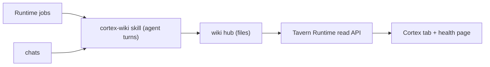

# Cortex

Cortex is Tavern's durable knowledge system: a plain-Markdown wiki hub the
agent reads and writes with its file tools, maintained as a pipeline drained
by Runtime jobs, and browsed read-only in the Cortex tab.

## At A Glance

The wiki files are the single source of truth. Tavern's database holds only
derived, rebuildable projections. There are no maintenance crons and no human
gates: detection is free filesystem work, agent runs happen only when the
pipeline has work, and uncertainty is recorded in the data (`confidence`,
`verified`) instead of being escalated to the user.

```text
hub/                               # TAVERN_WIKI_HUB_PATH — the only source
├── wikis.json  _index.md  log.md
└── topics/<topic>/
    ├── raw/         immutable sources, queryable from the moment of ingest
    ├── wiki/        compiled articles — synthesized, cross-linked,
    │                confidence-rated; permanent unknowns live here as
    │                verified: false plus a short note
    ├── todos/       queue: proposed → done (record deleted; log.md entry is
    │                the history) | blocked (transient — librarian retries or
    │                resolves into articles within ~30 days)
    ├── datasets/    manifests for structured data
    ├── output/      generated deliverables (reports, plans, catalogs)
    ├── inbox/       passive drop zone (chat-driven ingest only)
    ├── log.md       append-only history — compile detection and todo
    │                completions are read from it
    └── .librarian/  scan scores, hidden from the page tree
```

The pipeline, all Runtime jobs running direct agent turns through the gateway
(sessions `tavern-wiki-compile`, `tavern-wiki-todos`, `tavern-wiki-librarian`):

| Job | Trigger | Run |
| --- | --- | --- |
| `wiki-compile` | 15-min check: 5+ pending sources or one ~6h old, from `log.md` order | one turn: compile, structural pass, re-score touched articles |
| `wiki-todo-drain` | 15-min check: any `proposed` record, ~45 min between runs | one turn: complete-and-delete, or block with reason |
| `wiki-librarian` | weekly | score all, mechanical repairs, file outside-world work as todos, review blocked |
| `wiki-health-history` | hourly, no agent | trend samples on scan change |

## Architecture



## Hub Resolution

1. `TAVERN_WIKI_HUB_PATH` or `TAVERN_CORTEX_WIKI_PATH`
2. Runtime-managed `wiki/` under `TAVERN_RUNTIME_ROOT`

Managed Hermes startup prepares the `cortex-wiki` skill package before launch:

* copy the bundled `cortex-wiki` workflow skill directory into
  `HERMES_HOME/skills/cortex-wiki`
* create the managed hub skeleton when it does not exist
* pass `TAVERN_WIKI_HUB_PATH` to the Hermes process

## Runtime Contract

Runtime owns only:

* hub resolution
* read/write access checks
* topic listing
* Markdown file listing
* page reads
* light frontmatter parsing
* `[[wikilink]]` extraction
* backlink derivation
* simple title, path, and body search
* pipeline detection and scheduling (free filesystem checks that decide when
  to spawn a maintenance agent turn)

Runtime does not own:

* PGLite or vector storage
* embeddings
* claims
* schema registries
* source import processors
* chat ingestion
* Dream consolidation
* direct wiki file mutation — every write happens through an agent turn
  running the `cortex-wiki` skill, never Runtime code

## Workflows

Research, ingestion, compilation, audit, librarian, lessons, generated outputs,
todo maintenance, dataset maintenance, and archive lifecycle run through
Cortex wiki. Routine wiki maintenance is a pipeline drained by Runtime jobs — no
crons, no human gate:

* **Compile job.** A 15-minute filesystem check counts uncompiled raw sources
  per topic from `log.md` order; at 5+ pending sources (or one waiting ~6
  hours) it runs one agent turn that compiles them and finishes with a
  structural pass over changed wikis. Settle window and cooldown bound runs.
* **Librarian job.** Weekly: scores staleness and quality, writes
  `.librarian/scan-results.json`, repairs mechanical findings, recompiles from
  raw already on disk, and files outside-world work as todo records.
* **Todo job.** A 15-minute check drains todo records one agent turn at a
  time, spaced by a cooldown. A completed record is deleted — the `log.md`
  `todo` entry is the durable history. A record the agent cannot finish is
  kept and blocked with its reason, and the affected claims marked
  low-confidence — work is never parked on the user; corrections happen in
  conversation. Blocked is transient: the weekly librarian retries records
  whose blocker likely cleared and resolves the rest into the affected
  articles, deleting the record; nothing stays blocked past roughly thirty
  days.

The todo lifecycle is `proposed` → done (deleted) or `blocked` (transient);
see [Cortex Lifecycle](../docs/features/cortex-lifecycle.md).

The hub directory is part of the agent's workspace contract: agents read and
write it with plain file tools at `TAVERN_WIKI_HUB_PATH`, on the same machine
as Runtime and the engine. Any future agent sandboxing must mount the hub
path read-write inside the sandbox boundary.

## App Surface

The Cortex tab shows:

* topic selector
* Markdown page list (pure knowledge — dot directories and archived outputs
  stay out of listings and search)
* page body
* file metadata
* wikilinks and backlinks
* active and archived topic coverage
* a health card and health page: derived hub health, pipeline run state
  (compile, librarian, todos), the latest librarian report per topic, the
  todo queue with processing state and recent completions, and trend charts

Settings and Memory show hub readiness and counts. They do not expose embedding
or schema controls.
