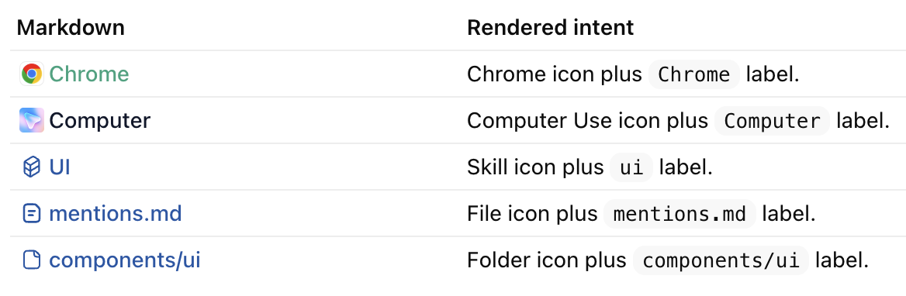

# Mentions

Mentions are `@` references that compile to markdown plus optional metadata.

A mention is just markdown. It is auto-completed into the composer when the
Tavern user types `@` and chooses a skill, plugin, app, file, or directory.
Metadata is stored with the message so Tavern can render chips and project
runtime context. The message must still make sense if metadata is missing.

Tavern renders mention-shaped markdown with a richer badge-like chrome in the
composer, transcript, prompt inspector, and any other agent input/output surface.

Supported projections:

- Plugins and apps stay in the prompt as markdown URIs, such as
  `[@Chrome](plugin://chrome@openai-bundled)`.
- Skills inject `<skill>` context with the skill name and `SKILL.md` path.
- Files and directories stay as paths or markdown links.
- Images keep a visible files block and also arrive as image input payloads.

## Contract

- Markdown is the source of truth.
- Metadata improves rendering, replay, and runtime projection.
- Missing metadata must not make the prompt unreadable.
- Mentions never enable, install, connect, or authorize capabilities by
  themselves.

## Mention Kinds

Tavern supports these mention kinds:

- `skill`: an agent skill available through the selected runtime or agent.
- `plugin`: a plugin-level capability such as Chrome, Computer Use, or a native
  Codex plugin.
- `app`: an app-backed connector or native Codex app capability.
- `file`: a concrete file reference.
- `directory`: a concrete directory reference.

Tavern should distinguish `file` and `directory` in metadata even though Codex
projects both as paths. A file points at one object; a directory points at a
collection the agent must choose to inspect.

## Runtime Projection

Every mention remains markdown first. Runtime projection describes what Tavern
adds, if anything, when sending the message to the agent:

- Capability references preserve plugin and app markdown URIs without adding
  hidden prompt text.
- Skill context loads explicit skill instructions when the runtime exposes the
  skill.
- Path references preserve file and directory paths for the agent to inspect
  through normal file tools.
- Image input sends actual image bytes or local image references through the
  runtime image path.

| Kind | Visible text | Projection | Runtime behavior |
| --- | --- | --- | --- |
| `skill` | `[$ui](/Users/zknicker/.agents/skills/ui/SKILL.md)` | `skill-context` | Inject a Codex-style `<skill>` block with the skill name, path, description, and instructions when the runtime exposes the skill. |
| `plugin` | `[@Computer](plugin://computer-use@openai-bundled)` | `capability-reference` | Preserve the markdown URI. Do not enable the plugin from the mention alone. |
| `app` | `[@Helium](plugin://computer-use@openai-bundled)` | `capability-reference` | Preserve the Codex plugin URI with the selected app name as the label. Let the Codex Computer Use tools resolve the app. Do not install, connect, or authorize the app from the mention alone. |
| `file` | `[mentions.md](/Users/zknicker/.codex/worktrees/1b41/tavern/specs/mentions.md)` | `path-reference` | Preserve the path. Do not automatically attach file contents. The agent may read the file through normal file tools if relevant. |
| `directory` | `[ui](/Users/zknicker/.codex/worktrees/1b41/tavern/apps/website/src/components/ui)` | `path-reference` | Preserve the path. Do not recursively attach directory contents. The agent may list or inspect the directory through normal file tools if relevant. |
| image file | `## Screenshot.png: /var/folders/.../Screenshot.png` | `image-input` | Preserve the visible files block and pass image bytes or `local_images` through the runtime image input path when supported. |

Runtime adapters should project mentions from stored metadata plus the visible
prompt. When metadata is missing, adapters may infer known markdown URI and path
references from visible text only when inference is conservative.

## Markdown Rendering

Tavern renders mention-shaped markdown as compact chips wherever agent input or
output is displayed.



Examples:

| Markdown | Rendered intent |
| --- | --- |
| `[@Chrome](plugin://chrome@openai-bundled)` | Chrome icon plus `Chrome` label. |
| `[@Computer](plugin://computer-use@openai-bundled)` | Computer Use icon plus `Computer` label. |
| `[$ui](/Users/zknicker/.agents/skills/ui/SKILL.md)` | Skill icon plus `ui` label. |
| `[mentions.md](/Users/zknicker/.codex/worktrees/1b41/tavern/specs/mentions.md)` | File icon plus `mentions.md` label. |
| `[components/ui](/Users/zknicker/.codex/worktrees/1b41/tavern/apps/website/src/components/ui)` | Folder icon plus `components/ui` label. |

The markdown remains valid without Tavern's renderer. The rich chip is
presentation only.

## Appearance

Mention kind remains the product contract. Runtime projection uses `kind`,
`id`, and metadata; UI polish is resolved separately.

Default rendering is kind-based:

| Kind | Default appearance |
| --- | --- |
| `skill` | Skill icon and skill tone. |
| `plugin` | Plugin icon and capability tone. |
| `app` | Plugin icon and capability tone. |
| `file` | File icon and path tone. |
| `directory` | Folder icon and path tone. |
| `image` | Image icon and path tone. |

Known bundled skills and plugins may override only presentation. For example,
Hermes's `github` skill can render as `GitHub` with a GitHub icon while it
still serializes and projects as a `skill` mention. Hermes's `gh-issues`
skill can render as `GitHub Issues` with the same icon while retaining its
exact runtime skill id.

Skill options use the runtime skill id as insertion text and derive a display
label for rendering. For example, `agent-browser` inserts and serializes as
`agent-browser`, but renders as `Agent Browser`. This follows Codex's pattern:
use an explicit display name when the runtime provides one, otherwise titleize
the skill id with common product and acronym exceptions such as `GitHub`,
`OpenAI`, `API`, and `UI`.

The frontend owns a typed appearance registry under
`apps/website/src/features/mentions/`. Appearance entries use stable keys such
as `icon: "github"` and `tone: "brand"` instead of arbitrary component
trees, so unsupported icons or tones fail at compile time.

## Serialization

Mentions are stored in Tavern message metadata under `metadata.tavern.mentions`.

Each stored mention includes:

- `kind`: the mention kind.
- `id`: the URI or path used by the visible markdown.
- `label`: the user-facing label rendered in the composer.
- `text`: the exact visible message slice.
- `start` and `end`: offsets in the submitted visible message.
- `projection`: the selected runtime projection.

The visible message should use natural Codex-compatible text. Files and
directories should render as path or markdown-link references. Skills, plugins,
and apps should render as readable names that match the trigger names described
in the runtime context.

## Autocomplete Options

Autocomplete options use one common shape across sources:

- `kind`: the mention kind.
- `label`: the visible label.
- `id`: the markdown link target or path.
- `insertText`: the text inserted before markdown serialization.
- `projection`: the runtime projection.
- `metadata`: source-specific facts, such as skill path, file path, or app
  bundle id.

Examples:

| Source | Option identity | Serialized markdown |
| --- | --- | --- |
| Skill | `kind: "skill"`, `id: "/Users/zknicker/.agents/skills/ui/SKILL.md"`, `insertText: "ui"`, `projection: "skill-context"` | `[$ui](/Users/zknicker/.agents/skills/ui/SKILL.md)` |
| Plugin | `kind: "plugin"`, `id: "plugin://computer-use@openai-bundled"`, `insertText: "Computer Use"`, `projection: "capability-reference"` | `[@Computer Use](plugin://computer-use@openai-bundled)` |
| App | `kind: "app"`, `id: "plugin://computer-use@openai-bundled"`, `insertText: "Helium"`, `metadata.bundleId: "net.imput.helium"`, `projection: "capability-reference"` | `[@Helium](plugin://computer-use@openai-bundled)` |
| File | `kind: "file"`, `id: "/Users/zknicker/.codex/worktrees/1b41/tavern/specs/mentions.md"`, `insertText: "mentions.md"`, `projection: "path-reference"` | `[mentions.md](/Users/zknicker/.codex/worktrees/1b41/tavern/specs/mentions.md)` |

## Autocomplete Sources

Mention autocomplete combines concrete source APIs:

- `mention.inventory` returns bounded mention sources that are safe to fetch
  once and filter locally: skills, plugins, and Mac apps.
- `mention.paths` searches unbounded workspace paths separately. It is
  query-driven and may show an independent `Files` loading state while the
  search is in progress.

Inventory sources:

- Skills come from the selected runtime agent's skill list.
- Plugins come from enabled Codex plugin manifests, such as
  `plugin://computer-use@openai-bundled`.
- Mac apps come from Tavern Runtime's local macOS app inventory. Runtime uses
  running app state and recent-use metadata for autocomplete ordering. App
  options may include a small native app icon data URL for presentation. App
  mentions keep `kind: "app"` in Tavern metadata and serialize with the Codex
  Computer Use plugin URI, such as
  `[@Helium](plugin://computer-use@openai-bundled)`.

Path search sources:

- Files and directories come from the selected agent workspace.
- Path search runs only for path-like or sufficiently specific queries.
- Path search must not block or hide inventory results.
- When path search is running, the picker shows a `Files` loading row. When no
  source has results, the picker shows `No results`.

The UI may derive richer labels, icons, and tones from the mention kind, URI,
and metadata, but stored metadata must keep the selected `kind`, `id`,
`projection`, and markdown text.

## Runtime Behavior

Skills use `skill-context`. Tavern stores the structured mention and the
Hermes Tavern Messenger projects selected skills into the agent-facing prompt
as Codex-style skill context when the runtime exposes the skill.

Example:

```xml
<skill>
<name>ui</name>
<path>/Users/zknicker/.agents/skills/ui/SKILL.md</path>
...
</skill>
```

Plugins and apps use `capability-reference` when they are already available in
the runtime context. Tavern preserves the markdown and does not add a hidden
reference block. Native Codex plugins follow Hermes's Codex app-server runtime
contract: Hermes config determines which Codex tools are available for a Codex
thread, and the model uses those tools from the visible prompt.

Computer Use app autocomplete uses Tavern Runtime's local macOS app inventory.
The app server reads the inventory from Runtime; it does not enumerate local
apps itself or ask the model to call Computer Use tools just to populate mention
options.

Files and directories use `path-reference`. Tavern should preserve the path in
the visible message and metadata. It should not attach file contents, directory
manifests, or recursive directory contents for Codex parity. The agent can read,
list, or inspect the path through normal file tools when needed.

Images and screenshots follow the Codex app pattern: the message includes a
visible "files mentioned" reference and the runtime receives the actual local
image attachment when supported.

## App Structure

Frontend mention UI lives in a shared `mentions` feature area. It owns
autocomplete option shapes, markdown chip renderers, and metadata helpers used
by the composer, transcript, and prompt inspector.

Runtime projection lives with the runtime adapter that sends the message to the
agent. Hooks and API procedures should expose concrete operations, such as
listing available skills, rather than a generic mentions API.
